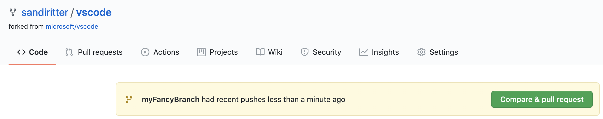

## Lab One - Forking a Repo

### This is an exercise in forking a repo, making a change and a pull request

#### Part I. Forking a repo

1. Log in to your personal github account, if needed.
2. In a browser, navigate to https://github.com/sandiritter/GithubBeyondTheBasics
3. In the upper right-hand corner, click on Fork:

   

4. If you only have access to your own personal repo, this will fork VSCode into your account.  However, if you have access to multiple repos, you will have to specify where to fork it.
5. Once forking is completed, you will be on the main page of your newly forked repo.

#### Part II. Cloning your forked copy of the repo
Now that you have a repo, you will follow normal flow to make a change. 

1. Click the copy button next to the repo name
2. Open your terminal
3. Navigate to a location where you prefer to store
your code, or create a new folder
4. Clone the repository
   
   ```git clone https://github.com/<therepocloned>.git``` 
5. Change directory to the new repo
6. Verify tracking is set up correctly. Start by checking what is currently setup 

   ``` git remote -v```

7. You should see something similar to this, where origin is your forked version of the repo

   

8. Let's set upstream tracking 

   ``` git remote add upstream https://github.com/ORIGINAL_OWNER/ORIGINAL_REPO.git```

9. Verify tracking is set up correctly
 ``` git remote -v```

1. You should now see something similar to this, where upstream is set to the repo that was forked

   

1. New we you are ready to create a new branch 
   
   ``` git checkout -b myBranchName```
   
1. In your favorite text editor, open this new branch and add a new file to the quotes directory. Name the file something unique and include a favorite quote in the file.  You can copy the existing file ```sandi.html``` as a starting point if you prefer.

1. Once done adding your file, check the status of you branch

    ```git status```

14. You should see that you have a new untracked file (which is the file you just added), so add the file to your stage area 

    ```git add .```

1. Now commit your changes 

   ```git commit -m "some meaningful message"```
   
1. And push your changes up to your repo 

   ``` git push origin my BranchName```

 #### Part III. Pull request
Let's create a pull request to merge your changes

1. Navigate to your repo in Github
2. You should see a messge block indicating your branch was recently pushed. Click on ‘Compare & pull request’

   

3. Verify the base repo and head repo are accurate (base is the original repo and head is your branch on your forked repo)

   

4. Click ‘Create Pull Request’

