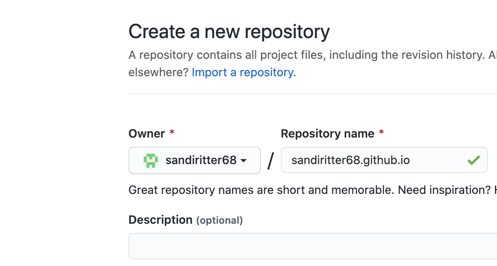
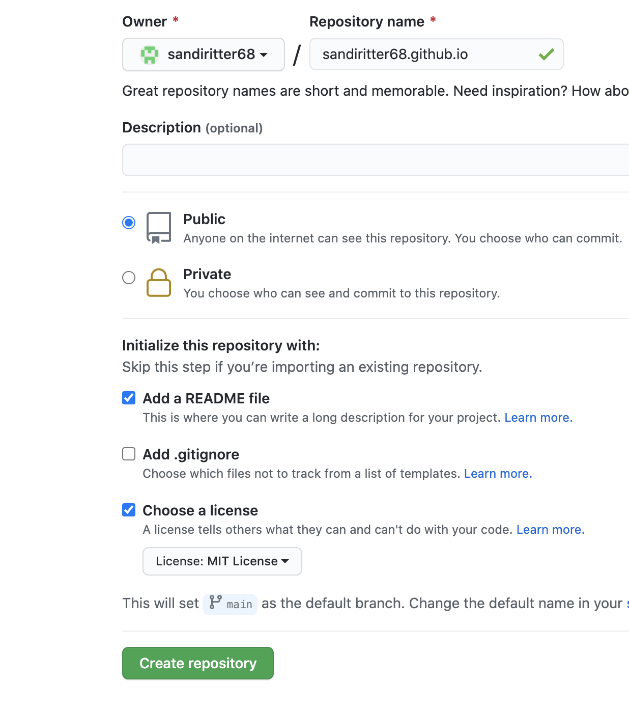
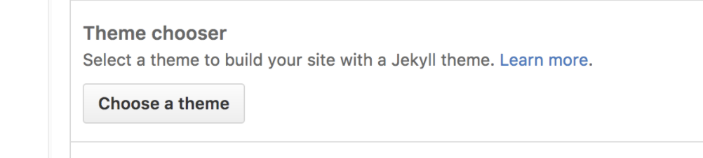
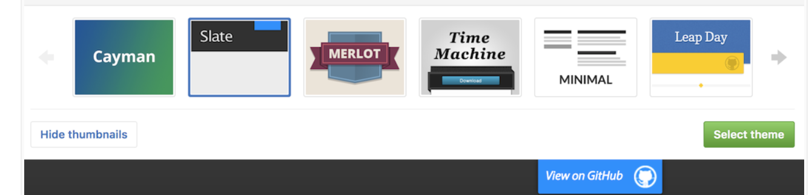
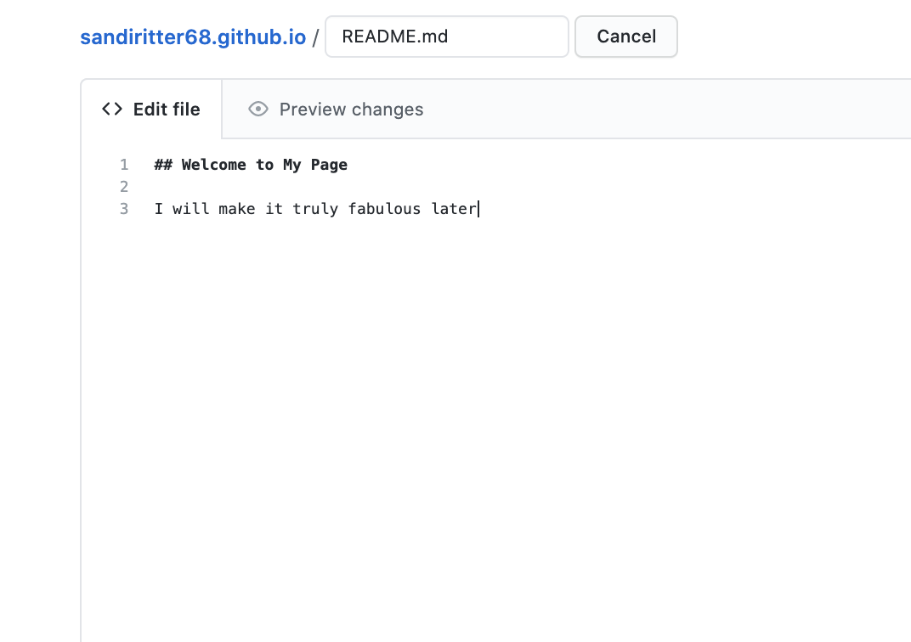
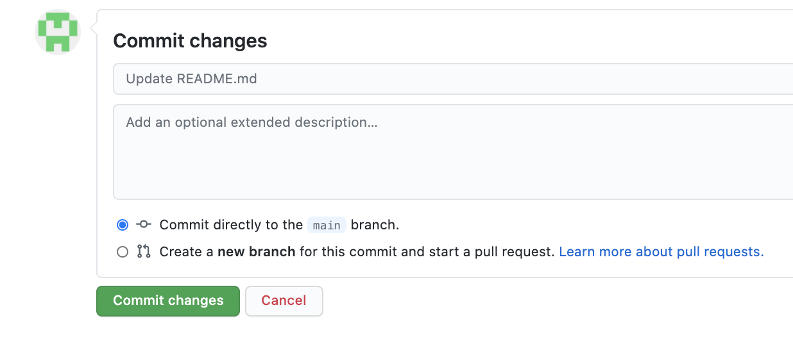

## Lab Two - Creating Your Github Page

1. Log in to your personal github account, if needed.
2. Create a new repo by clicking.  You may need to navigate to tour repos first, and then click on the New button in the upper right-hand corner.
3. On the create new repository page, you will need to fill in a name for your repo. This name **MUST** be following the convention username.github.io (where “username” is your actual GitHub user name).

   

4. Leave the access of Public, and click the boxes to add a README and choose a license

5. Click Create Repository

6. To begin setting up your site, navigate to Settings in your new repo

7. Scroll down to the Github pages section and click on Choose a theme

8. Scroll thru the available themes and when you find one you like, click on the green Select theme button on the right hand side

9. You will then be routed to a page where you can add your own details.  There will be default info on this page, and you can leave it for now if desired. However, what you see is what will be published on your github page. And you can always circle back later to change this info, and even select a new theme.

10. Now commit your changes

11. If you committed directly to the main branch, you can now navigate to your site, which will be located at username.github.io (where “username” is your actual GitHub user name).
